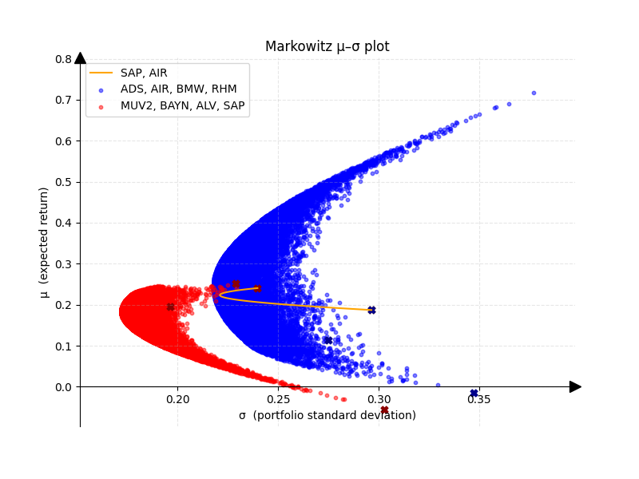

# Generating Markowitz μ-σ-Plots with real data from yahoofinance:

In his work, Harry Markowitz formalizes diversification and risk and makes it tanglible under certain assumptions. Here is a quick rundown of the theory behind this project.

## Theoretical background

In the following paragraphs we assume that the return of a stock follows a Gaussian Distribution and we calculate the mean return of a portfolio as follows: 
Given a portfolio of $N$ assets and their respective mean returns $\mu \in \mathbb{R}^N$ as well as 
their individual portfolio weights $x \in \mathbb{R}^n$ with $\sum_{n}^{N}x_n = 1$, portfolio mean return is:

$$\mu = \sum_{n}^{N} \mu_n * x_n$$

Mean Returns of individual assets are calculated via time series estimation of past closing prices.
Markowitz associates risk with volatility (expressed via variance $\sigma^2$ /standard deviation \sigma)
In order to calculate the risk assotiated with a portfolio and therefore with the mean return, we cannot simply add up individual variances of assets and have to consider their covariances. The covariance $s_{ij}$ between two individuals assets i and j is stated as:

$$s_{ij} = \frac{1}{T-1}\sum_{t}^{T}(x_{i,t}-\mu_i)(x_{j,t}-\mu_j)$$

and the correlation $k_{ij}$ as covariance normalized with individual standard deviations of asset i and j:

$$k_{ij} = \frac{s_{ij}}{\sigma_i \sigma_j}$$

The covariance between two assets allows us to express the covariance matrix $C$ with entries $c_{ij} = s{ij}$. With this we are now able to calculate the portfolio variance (and therefore the risk assotiated with a given protfolio) via the weighted sum over all covariances, as follows:

$$\sigma^2 = x^TCx$$

Assuming we have historical price data and can therefore calculate mean and covariance of assets withing our porfolio as well as the protfolio weights, the afforementioned formualars provide allow us to get the eman and variance of a given portfolio allocation. 

Plotting different asset allocations we can see a trend emerge. Furthermore this method allows the distinction of optimal versus suboptimal portfolios. Crudly speaking, when we can find an asset allocation that promises a higher return for equal volatility or less volatility for equal returns we think of that allocation as more optimal. 

  <table>
    <tr>
      <td align="center">
        
         
        <em>Four assets plot</em>
      </td>
      <td align="center">
        
         
        <em>Two assets plot</em>
      </td>
    </tr>
  </table>

Allocations follow a parabolic form and in the multi-asset case (more than two) we see the allocations spreading out.
All allocations with minimal risk for any given mean return are located on the so-called efficiency frontier. The shape of the efficiency frontier is dictated by the correlation between assets. In the two-asset-case, the efficiency frontier is visualized in the following gif. 

  
   
  <em>
    Visualizing the efficiency frontier based on different correlation coefficients. 
    (To generate the GIF, run <code>./pre_made_plots_scripts/generate_correlation_animation.py</code>)
  </em>

  
## Introduction of this project

This project allows for visualizing the possible risk assotiated with the mean return of a set of assets by plotting random allocations of a given stock portfolio on a μ-σ-diagram following the work of Markowitz. Data is pulled form the yahoo finace API. For portfolios containing more than two assets, the plot is visualized as a scatter plot with random allociation. For two assets, the efficiency frontier is displayed as a line plot and calculated in closed form. The script main.py generates μ-σ-diagrams for given portfolios. In case of 2 assets, the efficiency frontier is displayed as a line, otherwise scatter-plots of random allocations are produced. 

  <table>
    <tr>
      <td align="center">
        
         
        <em>Multi-protfolio-example plot utilizing main.py</em>
      </td>
      <td align="center">
        
         
        <em>Inputs corresponding to the multi-portfolio example </em>
      </td>
    </tr>
  </table>

To produce the example image, the provided inputs were used. Here a brief explanation of all parameters:
- portfolios: nested list of tickersymbols. each element corresponds to a portfolio with the given assets provided as ticker symbols.
              Note that german stocks require the ".DE" suffix. For more details check ticker symbols of yahoo finance.
- labels: the labels displayed for each portfolio in the legend of the plot. An empty string will result in a label containing all ticker symbols.
- colors: the coloration of the distribution/ efficiency frontier of each portfolio.
- colors_assets: the individual μ-σ-position of each stock is seperatly plotted and can also be colored.
- accuracy: controls the number of allocations sampled for each portfolio containing more than 2 assets.
- x_label: sets the displayed labelling for the x-axis
- y_label: sets the displayed labelling for the y_axis
- title_diagram: sets the title of the diagram
