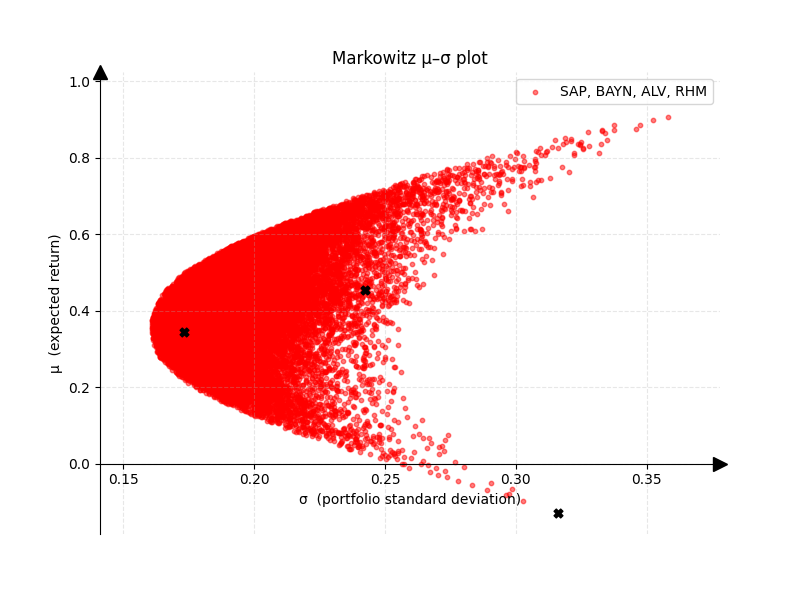
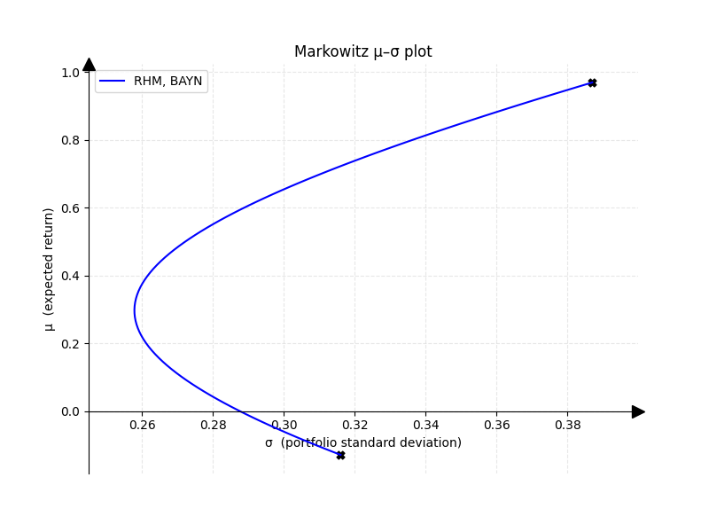
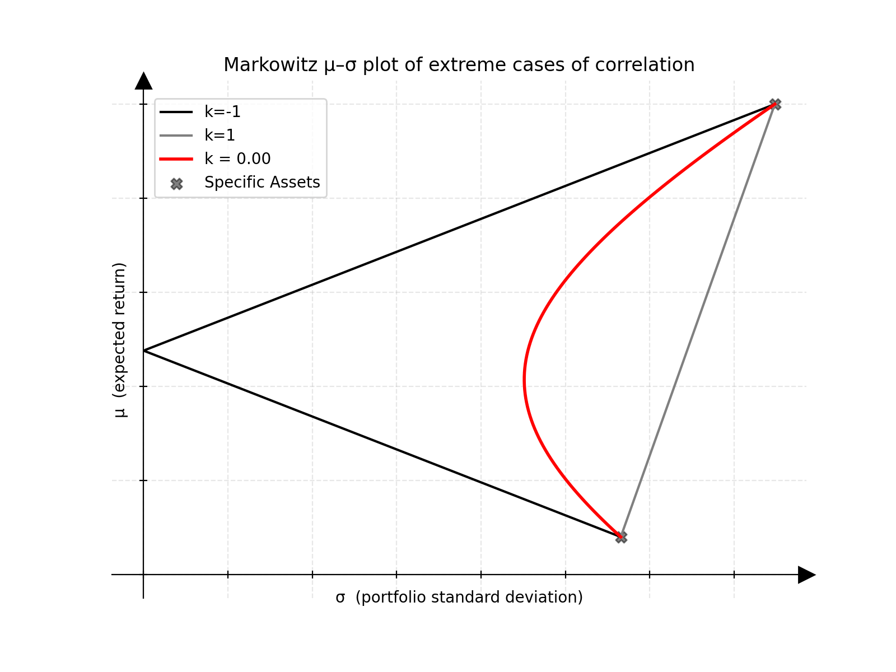

# Generating Markowitz μ-σ-Plots with real data from yahoofinance:

In his work, Harry Markowitz formalizes diversification and risk and makes it tanglible under certain assumptions. Here is a quick rundown of the theory behind this project.

## Theoretical background

In the following paragraphs we assume that the return of a stock follows a Gaussian Distribution and we calculate the mean return of a portfolio as follows: 
Given a portfolio of $N$ assets and their respective mean returns $\mu \in \mathbb{R}^N$ as well as 
their individual portfolio weights $x \in \mathbb{R}^n$ with $\sum_{n}^{N}x_n = 1$, portfolio mean return is:

$$\mu = \sum_{n}^{N} \mu_n * x_n$$

Mean Returns of individual assets are calculated via time series estimation of past closing prices.
Markowitz associates risk with volatility (expressed via variance $\sigma^2$ /standard deviation \sigma)
In order to calculate the risk assotiated with a portfolio and therefore with the mean return, we cannot simply add up individual variances of assets and have to consider their covariances. The covariance $s_{ij}$ between two individuals assets i and j is stated as:

$$s_{ij} = \frac{1}{T-1}\sum_{t}^{T}(x_{i,t}-\mu_i)(x_{j,t}-\mu_j)$$

and the correlation $k_{ij}$ as covariance normalized with individual standard deviations of asset i and j:

$$k_{ij} = \frac{s_{ij}}{\sigma_i \sigma_j}$$

The covariance between two assets allows us to express the covariance matrix $C$ with entries $c_{ij} = s{ij}$. With this we are now able to calculate the portfolio variance (and therefore the risk assotiated with a given protfolio) via the weighted sum over all covariances, as follows:

$$\sigma^2 = x^TCx$$

Assuming we have historical price data and can therefore calculate mean and covariance of assets withing our porfolio as well as the protfolio weights, the afforementioned formualars provide allow us to get the eman and variance of a given portfolio allocation. 

Plotting different asset allocations we can see a trend emerge. Furthermore this method allows the distinction of optimal versus suboptimal portfolios. Crudly speaking, when we can find an asset allocation that promises a higher return for equal volatility or less volatility for equal returns we think of that allocation as more optimal. 

 

## Introduction of this project

This project allows for visualizing the possible risk assotiated with the mean return of a set of assets by plotting random allocations of a given stock portfolio on a μ-σ-diagram following the work of Markowitz. Data is pulled form the yahoo finace API. For portfolios containing mroe than two assets, the plot is visualized as a scatter plot with random allociation. For two assets, the efficiency frontier is displayed as a line plot and calculated in closed form.

# GIF

*gif caption*
